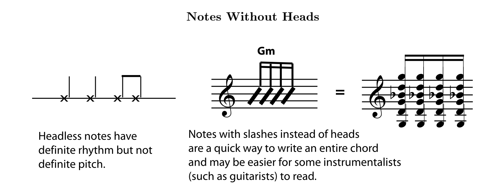

## Reference

https://www.opentextbooks.org.hk/tertiary-institutions/18034

# 0 Preface

- Expansion of "Introduction to Music Theory", but still the bare essentials
- Remember music comes first, then theory
- The physical basis of music, acoustics, is a necessary departure from this

# 1 Notation

## Pitch

### Staves

- Groups of staves are connected at least by a line at the left side, and sometimes at each bar line
- Staves played by similar instruments, or played by the same person e.g. the two staves of a piano part may be additionally connected by a brace

- Bass Clef mnemonics
  - lines: Good Boys Do Fine Always
  - spaces: All Cows Eat Grass
- The C Clef is moveable, middle C is wherever the centre is. The bass and treble used to be moveable, but now rare.

- The treble clef can be used to notate music an octave lower (instead of using the bass clef) and will then have a small 8 marked below it
- [ ] Print out and do the worksheets for both treble and bass clef

### Enharmonic

- Enharmonic **notes** have different “spellings” but sound the same
- **Keys and scales** can also be enharmonic e.g. Gb major and F# major
- **Intervals and chords** can be enharmonic e.g. augmented second and minor third
- Enharmonic assumes **equal temperament**, which has become the official tuning system for Western music. However instruments can drift towards **just intonation** based on the harmonic series. Enharmonic notes may now have slightly different pitches.

## Time

### Notes

- Notes can have heads (filled or not), stems, flags or beams and dots
- **Notes without heads** do not have one definite pitch e.g. crosses to show percussion or slashes to indicate chords

#### Stem directions

- Notes on or above the middle line - stems down
- Notes sharing a stem - direction based on note furthest away
- Beamed notes - direction based on note furthest away
- Different rhythm -
- Two parts for two performers - higher part stemps up, lower part stems down

# 2 Definitions

# 3 The Physical Basis

# 4 Notes and Scales

# 5 Harmony and Form

# 6 Challenges
